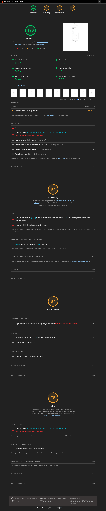
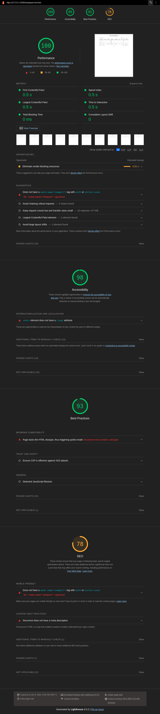
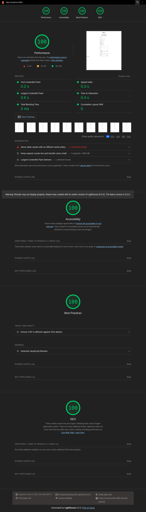
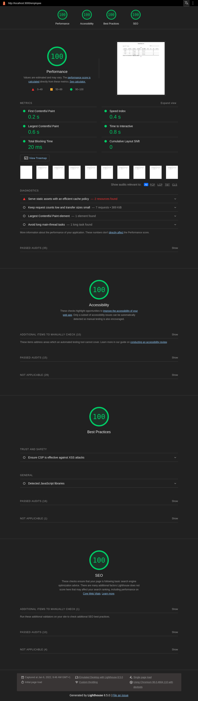

<h1> Présentation visuelle des analyses lighthouse</h1>
<ul>
    <li><a href="img1">1ere page du site originale HRnet</a></li>
    <li><a href="img2">1ere page du site originale HRnet</a></li>
    <li><a href="img3">1ere page du site originale HRnet</a></li>
    <li><a href="img4">1ere page du site originale HRnet</a></li>
</ul>
<h2 id="img1">1ere page du site originale HRnet</h2>

<a href="/">Top</a>
<h2 id="img2">2e page du site originale HRnet</h2>

<a href="/">Top</a>
<h2 id="img3">1ere page du site react HRnet</h2>

<a href="/">Top</a>
<h2 id="img4">2e page du site react HRnet</h2>

<a href="/">Top</a>